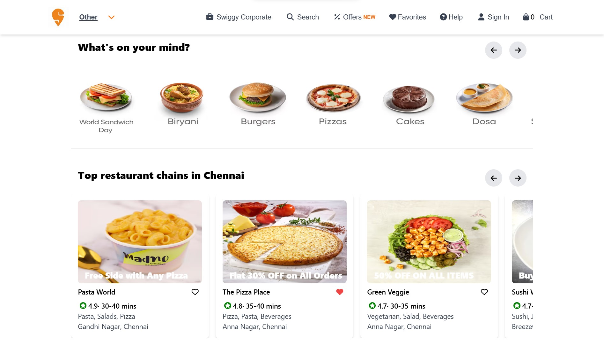
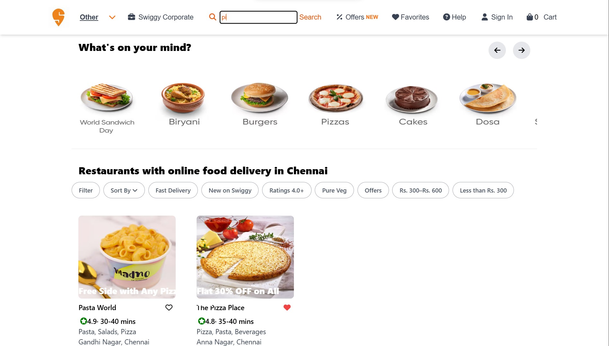
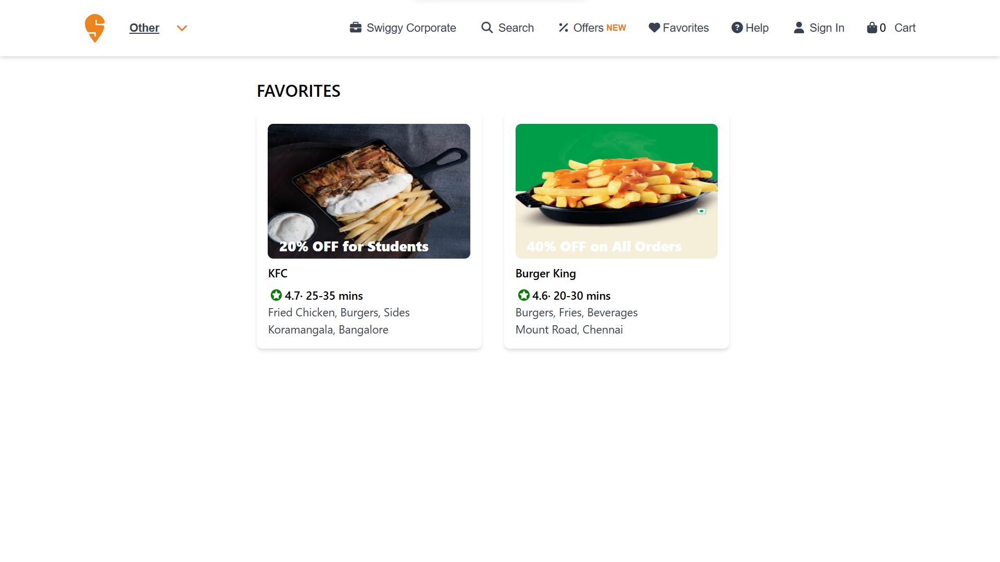
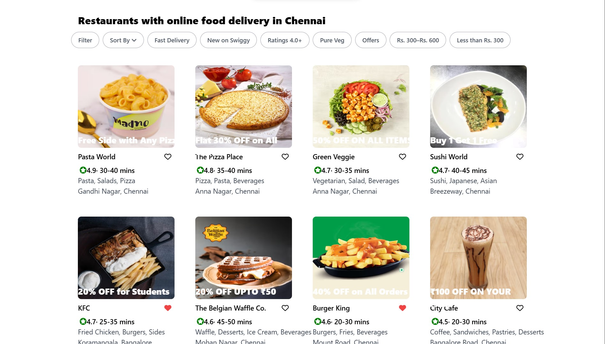
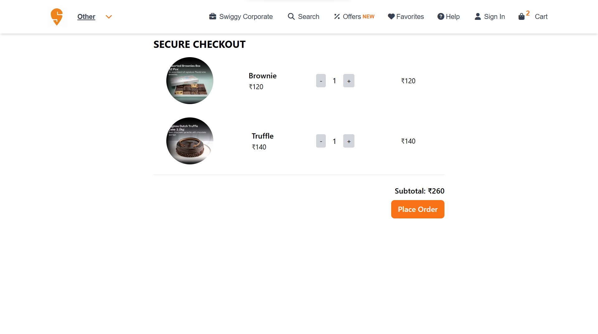
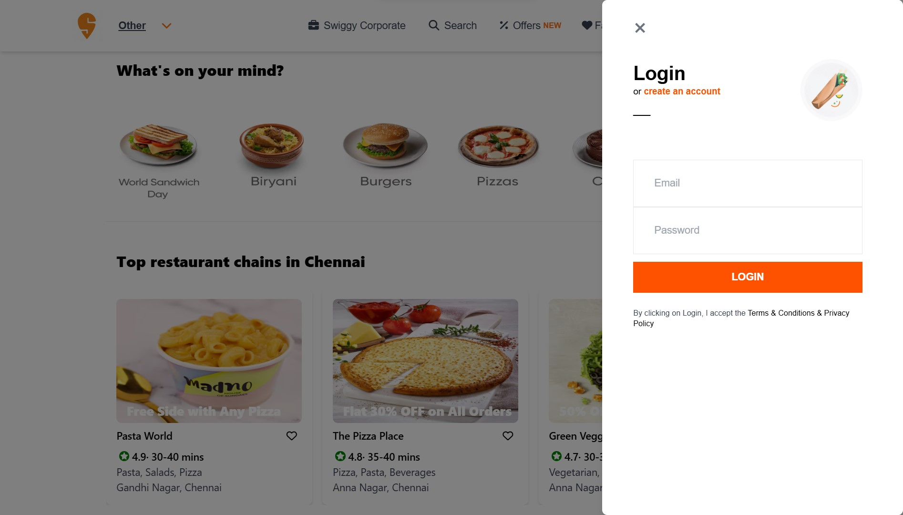
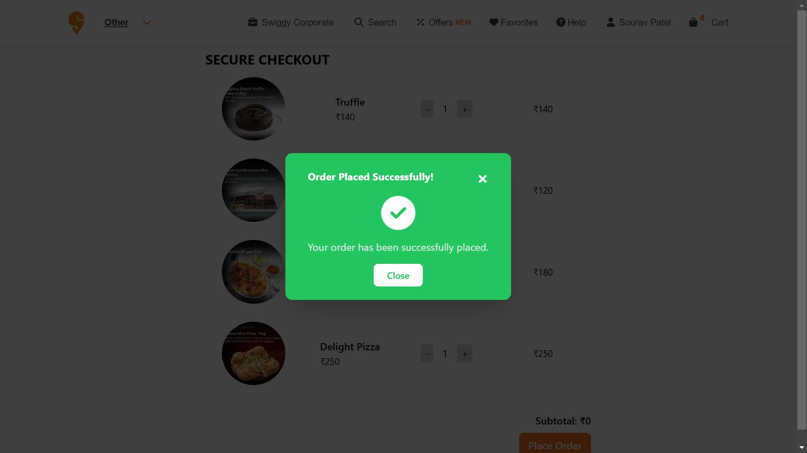

# Swiggy Clone

A **Swiggy-inspired** food ordering application built using **Angular** and **Tailwind CSS**. This application enables users to browse restaurants, add items to the cart, manage a favorites list, authenticate securely, and place orders.

---

## Table of Contents
- [Pages](#pages)
- [Mock APIs](#mock-apis)
- [Features](#features)
- [Project Structure](#project-structure)
- [Services](#services)
- [Tech Stack](#tech-stack)

---

## Pages

### 1. **Home Page**
The **Home Page** features a collection of the top restaurants and food items. Users can scroll horizontally to explore different restaurant options, each with a featured dish or promotion.



### 2. **Search Page**
The **Search Page** provides a search bar at the top, allowing users to filter restaurants and dishes by their names. It helps users quickly find what they’re looking for by typing keywords into the search bar.



### 3. **Favorites Page**
The **Favorites Page** lists all the dishes and restaurants that users have marked as their favorites. It uses Angular services and `localStorage` to store the favorites for quick access across sessions.



### 4. **Restaurant Page**
On the **Restaurant Page**, users can view the restaurant's full menu, select items, and add them to the cart. The page only allows users to order from one restaurant at a time.



### 5. **Cart Page**
The **Cart Page** allows users to view items they have added to the cart, adjust item quantities, and calculate the total cost. Authenticated users can proceed to place the order.



### 6. **Sigin/SingUp Page**
The **Sigin/SingUp Page** enables users to securely log in or register using their credentials. The user details are stored and retrieved via MockAPI for secure authentication.




### 7. **Order Confirmation Page**
The **Order Confirmation Page** is shown after a successful order placement, summarizing the details of the order and providing an option to go back to the homepage or continue exploring other restaurants.



---

## Mock APIs

The application uses MockAPI to store user and order data. The APIs are used to authenticate users and manage orders.

- **User API**: This API handles user registration, login, and retrieval of user data.
  - **URL**: [https://6717c6c6b910c6a6e029ed90.mockapi.io/users](https://6717c6c6b910c6a6e029ed90.mockapi.io/users)
  - **Methods**:
    - `GET`: Retrieve all users.
    - `POST`: Register a new user.
    - `PUT`: Update user details.
    - `DELETE`: Delete a user.

- **Order API**: This API is used to store the order details once a user has confirmed an order.
  - **URL**: [https://6717c6c6b910c6a6e029ed90.mockapi.io/orders](https://6717c6c6b910c6a6e029ed90.mockapi.io/orders)
  - **Methods**:
    - `GET`: Retrieve all orders.
    - `POST`: Place a new order.
    - `PUT`: Update an existing order.
    - `DELETE`: Delete an order.

---

## Features

**1. Home Page**
- Lists featured food items and top restaurants.
- Users can scroll to explore available restaurants and dishes.

**2. Search Feature**
- A search bar allows filtering by food or restaurant name.
- Helps users easily find specific items or restaurants.

**3. Favorites Page**
- Users can mark restaurants and dishes as favorites directly from the homepage.
- Favorites are saved with Angular services and `localStorage`, enabling quick access.

**4. Restaurant Page**
- Displays a detailed menu with various food items available for selection.
- Users can add items from only one restaurant at a time to their cart.

**5. Cart Page**
- Allows users to add items to the cart with real-time cost calculation.
- Users can adjust item quantities; only authenticated users can proceed to place an order.

**6. Authentication**
- Managed by MockAPI, enabling secure login and registration.

**7. Place Order**
- A modal prompts users to enter their address to finalize an order.
- Order details, including user information, address, cart contents, and restaurant name, are stored in MockAPI.

---

## Project Structure

The project is organized as follows:

- **/src/app**: Main application folder containing components, services, and configuration files.
  - **cart**: Handles cart-related functionalities, including item addition, removal, and quantity updates.
  - **favourite**: Displays the user's favorites list.
  - **hero**: Contains the homepage features, such as top dishes and featured restaurants.
  - **login**: User login functionality and interface.
  - **navbar**: Displays the navigation bar, including links to different pages and cart status.
  - **orders**: Displays order details and handles order placement.
  - **signup**: User registration interface and functionality.

- **app.component.ts**: Root component of the application.
- **app.config.ts**: Configuration settings for the application, such as API URLs.
- **app.routes.ts**: Defines the routing for the application.

---

## Services

The application uses multiple Angular services to manage data and user interactions:

- **Cart**: Manages the cart, including item addition, removal, and total cost calculation.
- **Login**: Manages user authentication.
- **Order**: Manages order-related functionality i.e. placing orders.
- **Restaurant**: Handles restaurant data, including retrieving restaurant lists.
- **Search**: Provides search functionality, allowing users to filter by food or restaurant names.
- **Signup**: Manages user registration functionality.


## How to Run

Follow these steps to run the application locally:

### Prerequisites
Ensure that you have the following installed:
- **Node.js** (v14 or above)
- **npm** (Node Package Manager)

### 1. Clone the Repository
Clone the project from GitHub using the following command:

```bash
git clone https://github.com/tonystark5683/swiggy-clone.git
cd swiggy-clone
npm install
ng serve


Now, you should be able to explore the food ordering application on your local machine! Enjoy browsing and placing orders on your Swiggy-inspired clone.